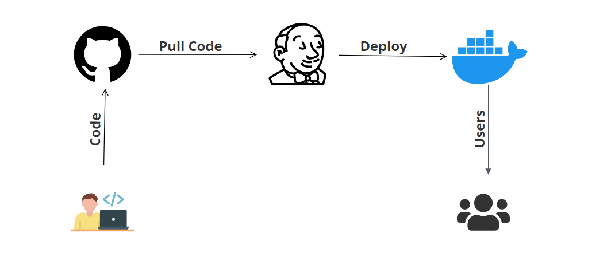

# Automated CI/CD Pipeline with Jenkins for Node.js Apps

This project demonstrates a complete CI/CD workflow using **Jenkins**, **Docker**, and **GitHub** to build, deploy, and run a **Node.js To-Do App** inside a Docker container.


### 🧱 Tech Stack

- Node.js (Express)
- Jenkins (running on AWS EC2)
- Docker
- GitHub (webhook integration)


### 🔧 Project Features

- Jenkins freestyle project configured for Node.js builds
- GitHub integration with Jenkins (webhook-based build trigger)
- Jenkins plugins: GitHub, Docker, NodeJS, etc.
- Dockerized pipeline: Build, Deploy & Run app container
- Hosted on an EC2 instance with Jenkins pre-installed


### 🔄 CI/CD Workflow



1. Developer pushes code to GitHub repo.
2. GitHub webhook triggers Jenkins build.
3. Jenkins pulls the repo → installs dependencies.
4. Docker image is built and tagged.
5. Jenkins runs the Docker container locally.


### 📁 Project Structure

```sh
jenkins-nodejs-pipeline/
├── Dockerfile
├── Jenkinsfile
├── app.js
├── package.json
└── README.md
```


### ▶️ Manual App Run Instructions (for testing)

```sh
# Install Node.js & npm (Debian/Ubuntu)
sudo apt update && sudo apt install nodejs npm -y

# Install dependencies
npm install

# Run app locally
node app.js
```

> The app runs on `http://localhost:3000` (by default).


### 📌 Jenkins Setup Notes

1. Launch Jenkins on AWS EC2
   - Use Ubuntu-based EC2
   - Install Java, Jenkins, and Docker
   - Add jenkins user to Docker group

2. Configure Jenkins
   - Install GitHub + Docker plugins
   - Create Freestyle Project
   - Connect to GitHub repo via webhook
   - Add build steps:
    ```bash
    npm install
    docker build -t nodejs-app .
    docker run -d -p 3000:3000 nodejs-app
    ```

### 🧪 Test the Deployment

After successful build:
   - Visit `http://<EC2-Public-IP>:3000`
   - App should display a sample To-Do UI


### 🧹 Clean Up (Optional)

```sh
docker ps          # List containers
docker stop <id>   # Stop container
docker rm <id>     # Remove container
docker rmi nodejs-app  # Remove image
```


### 🏁 Summary

- This hands-on project shows how to:
- Automate builds with GitHub + Jenkins
- Use Docker to containerize a Node.js app
- Run the app on AWS EC2 instance as part of a CI/CD flow